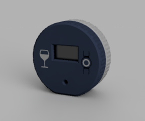
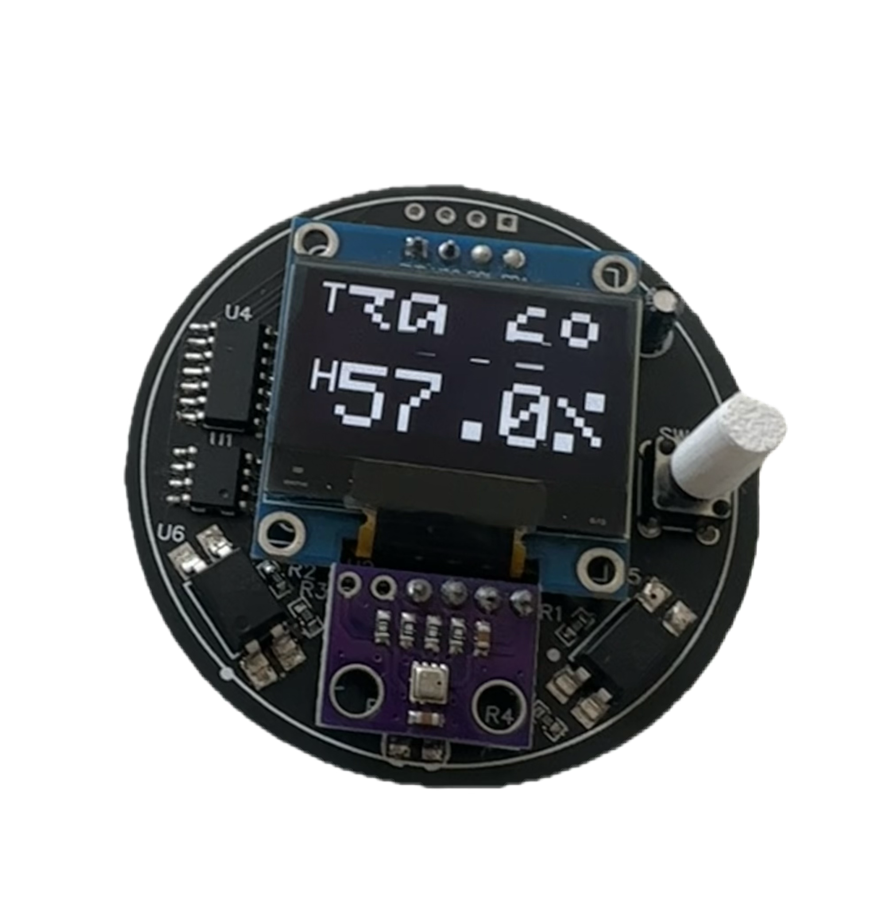

# Indoor Weather Tracker

A small but featureful device to monitor temperature and humidity indoors. It uses a BME280 sensor to collect data and displays current and historical data on the OLED screen.

## Features
- Measures temperature, humidity, and pressure using the BME280 sensor.
- Displays real-time data on a 128x64 OLED screen.
- Shows a graph of historical temperature and humidity data.
- Low power consumption.

## Components
There are 2 microcontrollers onboard, an ATTiny412, and an ATTiny1614. The ATTiny412 is responsible for sending a wake
up pulse every 4 hours to turn on the power to the ATTiny1614 which controls the sensor and screen system.

A power latching circuit is used to ensure between measurements the ATTiny1614, sensor and OLED consume 0 power. This 
power can be latched (turned on) by either the physical press of a button to enter the display mode or by the ATTiny412
wake up pulse.

### BOM
| Qty | Part Description           | Part Number     | Notes                           |
|-----|----------------------------|-----------------|---------------------------------|
| 1   | ATTiny412 Microcontroller  | ATTINY412-SSU   |                                 |
| 1   | ATTiny1614 Microcontroller | ATTINY1614-SSU  |                                 |
| 1   | BME280 Sensor Module       | BME280          |                                 |
| 1   | 128x64 OLED Display Module | SSD1306         | I2C Interface                   |
| 1   | Push Button                |                 | For power latching              |
| 1   | NPN Transistor             | MMBT3904        | For power latching              |
| 1   | P Mosfet                   | AO3407A         | For power latching              |
| 1   | Diode                      | 1N5819          | For power latching              |
| 2   | Optocouplers               | PC817           | For power latching              |
| 1   | Resistors                  | Various         | For power latching and pull-ups |
| 1   | Capacitors                 | Various         | For power stability             |
| 1   | PCB                        |                 | Custom designed PCB             |
| 1   | Battery Holder             | Coin cell sized | For power supply                |
| 1   | Coin Cell Battery          | CR2032          |                                 |
| 1   | Enclosure                  |                 | To house the device             |

## Schematic and PCB
The schematic and PCB layout files are available in the `res` directory. The PCB is designed to be compact and fit within a small enclosure.
The Fusion 360 design files are also included for 3D printing the enclosure.

## Firmware
The firmware for both microcontrollers is written in C++ using the Arduino framework.
- The code for the ATTiny1614 can be found in the '/src' directory and should be compiled and uploaded using platformio.
- The ATTiny412 code is located in the '/TempTimer' directory and can be compiled and uploaded using the Arduino IDE. Ideally using MegaTinyCore and power saving settings.

## Notes
- This project is intended for educational purposes and personal use. Please ensure you have the necessary skills and knowledge to work with electronics safely.
- The project is held under the MIT License found here: [LICENSE](LICENSE)
- No liability is assumed for any damages or injuries resulting from the use of this project.
